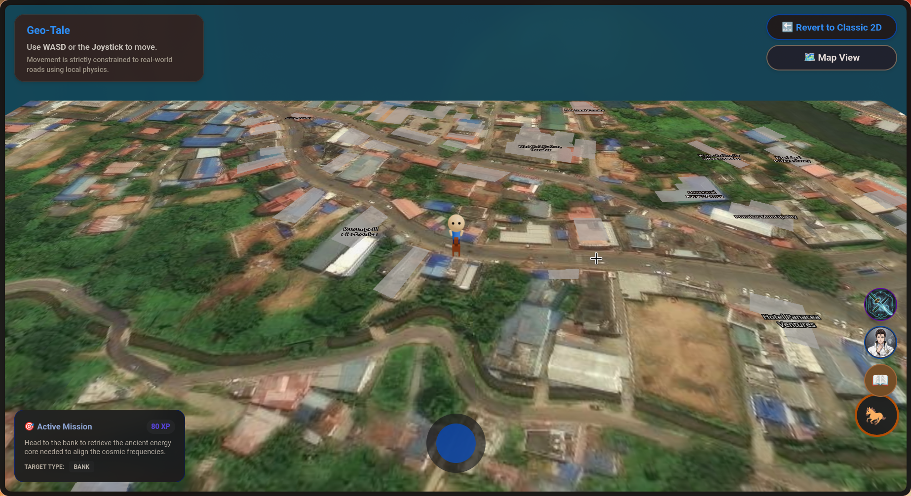
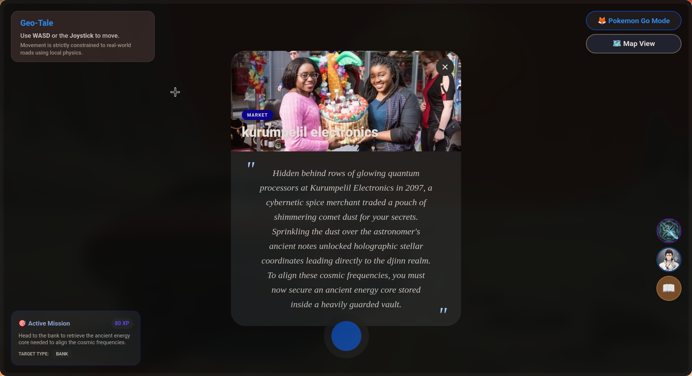
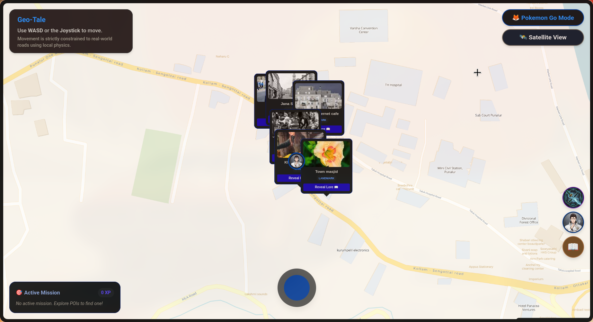
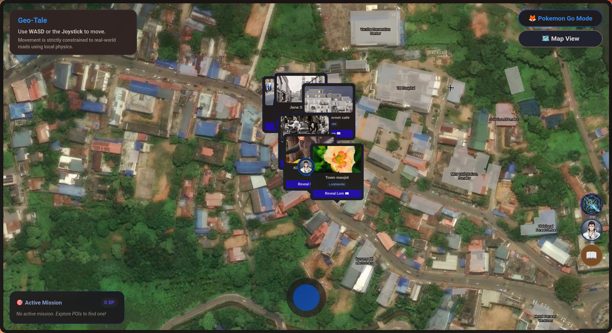

# LiveMap 🎯


## Basic Details
### Team Name: Red Pill


### Team Members
- Team Lead: Basith Ali KP - NSS College of Engineering, Palakkad
- Member 2: Bensen Biju - NSS College of Engineering, Palakkad

### Project Description
LiveMap is a web based game where users explore a real-world map using open street maps to unlock a location-based, AI-generated branching story with real-time multiplayer party syncing and lorebooks

### The Problem (that doesn't exist)
Creating a RPG that changes dynamically according to real life

### The Solution (that nobody asked for)
Using Open Street maps for map and Storyline, Avatars and Powers the game takes 'interactive' to next level

## Technical Details
### Technologies/Components Used
For Software:
- Languages: TypeScript, HTML, CSS
- Frameworks: React, Vite, TailwindCSS
- Libraries: Leaflet.js, React-Leaflet, react-joystick-component
- Tools: Google Gemini API (Story generation), Nominatim OSM API (Reverse geocoding), Firebase (Multiplayer Syncing)

### Implementation
For Software : [Check this link](https://useless-project-temp-chi-topaz.vercel.app/)
# Installation
```bash
npm install
```

# Run
```bash
npm run dev
```

### Project Documentation
For Software:

# Screenshots

*3D map mode displaying dynamic building extrusions and a player character horse avatar.*


*Lore Generation interface showing location-based, AI-generated branching story using the Gemini API.*


*Normal view showcasing the default interactive map exploration with virtual joystick.*


*Satellite view displaying the map with real-world satellite imagery.*


### Project Demo
# Video
[Video Link](https://drive.google.com/file/d/12Mc28_yRqsMrScy3km2kAkIJWG0-1Jpq/view?usp=sharing)
*This video demonstrates the core gameplay loop, showcasing avatar movement, exploration on a real-world map, the virtual joystick interface, and AI-generated story elements.*

## Team Contributions
- Basith Ali KP: [Lore implementation, Avatar Creation, Missions]
- Bensen Biju: [Map, 3D View, Avatar rules]

---
Made with ❤️ at TinkerHub Useless Projects 


